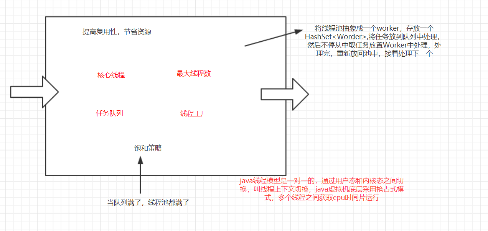

[TOP]

## 1.线程run和start的区别？两次start同一个线程会怎样？

**run()**是一个普通的方法，可以重复调用，直接调用不会启动新的线程，

**start()**会启动新的线程，处于就绪状态，并没有运行，一旦获得cpu时间片，执行相应的run方法，run方法执行结束，该线程就结束了

不允许执行两次start方法，

线程首先会运行一次，然后抛出java.lang.IllegalThreadStateException异常

第二次start时，该线程可能处于死亡状态（非new新建状态）

## 2.java的线程模型？说一下volatile关键字及原理？volatile是线程安全？说一下volatile与synchronized区别？

线程模型，java是一对一，用户态和内核态之间切换，大量线程会影响性能，java内存模型规定所有的变量都存储在主内存中， 每条线程还有自己的工作内存，线程的工作内存保存了该线程使用到的变量的主内存副本拷贝；

volatile修饰变量，**能保证所有线程的可见性**，但并不能保证其原子性，当volatile修饰的变量被修改时，新值对所有线程会立即更新，

还能**避免指令的重排序**

使用场景一读N写

volatile原理：多线程之间都有各自私有的内存，volatile修改的变量对其进行写操作时，会有一个**Lock前缀的指令**，该指令会使当前处理器缓存数据写到主内存中，并其他缓存中该共享变量内存地址失效，重新从主内存中读取数据，这样就保证了多个处理器缓存时一致的。

**线程不安全的**

**区别**：

a.volatile仅能使用在变量级别；synchronized则可以使用在变量、方法、和类级别的

b.volatile本质是在告诉jvm当前变量在寄存器（工作内存）中的值是不确定的，需要从主存中读取；synchronized则是锁定当前变量，只有当前线程可以访问该变量，其他线程被阻塞住

c.volatile只能保证变量的可见性，并不能保证原子性 而synchronized则可以保证变量的修改可见性和原子性

d.volatile不会造成的阻塞 而synchronized可能会造成线程的阻塞

e.volatile标记的变量不会被编译器优化，而synchronized可以

## 3.线程池原理？项目中实际运用？核心线程和非核心线程区别？你在项目中怎么确定核心线程数？

所谓线程池被抽象成一个worker，它是基于AQS实现，存放在一个new HashSet<Worker> 成员变量中 则把需要执行的任务放在成员变量中BlockQueue<Runnable> workQueue, 大致就是从workQueue中不断取任务放在worker中执行

参数 

1)corePoolSize：线程池的基本大小，当提交一个任务到线程池中，线程池会创建一个线程来执行任务，即使其他空闲的基本线程能够执行新任务也会创建新的线程，等到需要执行的任务数大于线程池基本大小就不再创建，如果调用了线程池的prestartAllCoreTheads方法，线程池会提交会启动所有基本线程 

2)maximumPoolSize：线程池最大大小，线程池允许创建最大的线程数，如果队列满了，并且已创建的线程数小于最大线程数，则线程池会再创建新的线程执行任务 如果使用了无界队列这个参数就没啥效果 3)runableTaskQueue任务队列，用于保存等待队列的阻塞队列fifo ArrayBlockQueue LinkedBlockQueue synchronousQueue 

4)RejectedExecutionHandler 饱和策略 当队列和线程池都满了说明线程处于饱和状态 默认AbortPolicy 无法处理新任务时则抛出异常 CallerRunsPolicy使用调用者所在线程来运行任务 DiscardPolicy 不处理 丢弃掉 DiscardOldestPolicy丢弃队列中最近的一个任务，并执行当前任务 

5)ThreadFactory 用于生产线程

N=cpu核数

WT=线程等待时间

ST=线程运行时间

线程数=N*（1+WT/ST）

