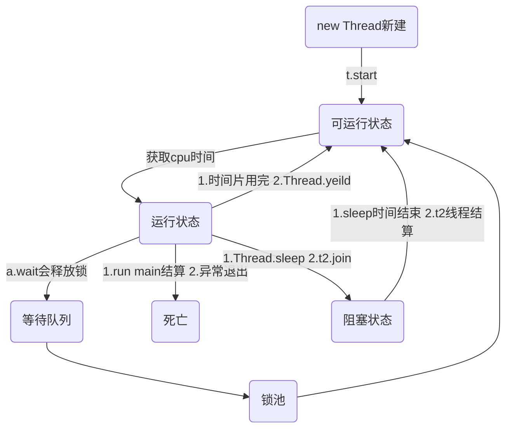

[TOC]


### 0 概念
#### 1.进程和线程
进程程序资源分配的最小单位，进程内部有多个线程，会共享这个进程的资源线程，cpu调度的最小单位.
#### 2.并发和并行
并行：同一时刻 可以处理事情的能力
并发：单位时间内可以处理事情的能力

#### 3.线程如何启动和中断
##### 线程如何启动
1)继承Thread
2)实现Runnable
3)实现callable
##### 线程如何中断
以前方法 #stop #resume #susupend 已经废弃直接中断，不会释放资源
现在
interrupt:中断线程 并不是强行关闭这个线程，只是打个招呼 中断的标志位置为true
isInterrupted:判断当前线程是否处于中断状态
Thread.interrupted:断定当前线程是否处于中断位置，中断标志改成false

#### 1.什么叫线程同步
是指线程与线程之间的制约关系，一个线程的执行依赖于另一个线程的消息，当它没有达到另一个线程的消息应等待，直到消息到达时被唤醒
#### 2.独占模式和共享模式
处于独占模式其他线程获取该锁将无法获取成功
在共享模式，多个线程获取某个锁可能获取成功
#### 3.活跃性问题
##### 1).死锁
##### 2).饥饿
一个线程或者多个线程因为种种原因无法获取所需资源，导致一直无法执行的状态
造成原因：
a.高优先级的线程吞噬低优先级的线程的cpu时间片
#setPriority 1-10 默认是5
b.线程永久阻塞在等待进入同步块的状态
c.等待的线程永远不会被唤醒
##### 3).活锁
#### 4.性能
多线程不一定提高性能
#### 5.线程安全性问题
多个线程共享资源
对资源进行非原子性操作

##### 1.单例模式
（1）饿汉式
```
/**
 * 饿汉式
 * 绝对的线程安全
 */
public class Test1 {

    private static Test1 t = new Test1();

    private Test1() {
    }

    public static Test1 getInstance() {
        return t;
    }
}

```
（2）懒汉式
```

/**
 * 懒汉式
 */
public class Test2 {

    /**
     * 禁止指令重排序
     */
    private volatile Test2 t;

    private Test2() {

    }

    /**
     * 双重检查加锁
     * 
     * @return
     */
    public static Test2 getInstance() {
        if (t == null) {
            synchronized (Test2.class) {
                if (t == null) {
                    t = new Test2();
                }
                //一般步骤是 1. 申请内存空间
                //2 实例化对象
                //3 instance引用指向这块空间地址
                // JVM存在指令重排 比如 1 3 2
            }
        }
        return t;
    }
}

```

#### 6.线程通信


### 1.Thread

#### 1.setDaemon
```
    public final void setDaemon(boolean on) {
        checkAccess();
        //setDaemon(boolean on) 方法，必须在Thread#start() 方法之前调用，否则运行时会抛出异常
        if (isAlive()) {
            throw new IllegalThreadStateException();
        }
        daemon = on;
    }
```
java中线程分 user Thread 和daemon thread,
异:当所有非守护线程结束了,程序就结束了,同时会杀死所有守护线程
设置该线程为守护线程

### 2.Lock接口
lock可以显示地获取锁和释放锁，繁琐，能让代码更灵活
synchronized不需要显示的获取和释放锁，简单
##### a.非阻塞的获取锁
##### b.能被中断的获取锁
##### c.超时获取锁
### 3.AbstractQueuedSynchronizer AQS
###### 独占模式
其他线程试图获取该锁将无法取得成功
###### 共享模式
多个线程获取某个锁可能（但不是一定）会获得成功

##### 1）tryAcquire(int)
##### 2）tryRelease(int)
##### 3） tryAcquireShared(int)
##### 4） tryReleaseShared(int)
##### 5）isHeldExclusively()

## 4.线程池

#### 4.1 参数

#####  1)corePoolSize：

线程池的基本大小，当提交一个任务到线程池中，线程池会创建一个线程来执行任务，即使其他空闲的基本线程能够执行新任务也会创建新的线程，等到需要执行的任务数大于线程池基本大小就不再创建，如果调用了线程池的prestartAllCoreTheads方法，线程池会提交会启动所有基本线程

#####   2)maximumPoolSize：

线程池最大大小，线程池允许创建最大的线程数，如果队列满了，并且已创建的线程数小于最大线程数，则线程池会再创建新的线程执行任务 如果使用了无界队列这个参数就没啥效果 

#####  3)runableTaskQueue

任务队列，用于保存等待队列的阻塞队列fifo ArrayBlockQueue LinkedBlockQueue synchronousQueue 

#####  4)RejectedExecutionHandler

 饱和策略 当队列和线程池都满了说明线程处于饱和状态 

默认AbortPolicy 无法处理新任务时则抛出异常 

CallerRunsPolicy使用调用者所在线程来运行任务 

DiscardPolicy 不处理 丢弃掉 

DiscardOldestPolicy丢弃队列中最近的一个任务，并执行当前任务 

#####  5)ThreadFactory 用于生产线程

#### 4.3.java中线程池是如何实现?

所谓线程池被抽象成一个worker，它是基于AQS实现，存放在一个new HashSet<Worker> 成员变量中 则把需要执行的任务放在成员变量中BlockQueue<Runnable> workQueue, 大致就是从workQueue中不断取任务放在worker中执行

#### 4.4.线程池中的线程是怎么创建的 ？ 

 是 一 开 始 就 随 着 线 程 池 的 启 动创 建 好 的 吗?

线程池默认是不启动的，work等待所有请求才会启动 每当我们调用execute（）方法添加一个任务，线程池会执行如下判断： 如果正在运行的线程池数据小于corePoolSize，那么会马上创建线程执行，即使存在有空闲的worker,如果大于，则将这个任务放在任务队列中，如果队列也满了，并且小于maximunPoolSize，则会创建非核心线程立刻运行这个任务，如果大于maximunPoolSize,那么线程池会抛出异常，RejectExecutionException。 当一个线程完成时，它会从队列中取下一个任务来执行，当一个线程无事可做，超过设置keepAliveTime，并且大于corePoolSize，那么这个线程就会被停掉，所以线程池所有任务完成后，它最后会收缩到corepoolSize

#### 4.5.jdk自带线程池

##### (1)SingleThreadExecutor:

corepoolsize为1，maximunPoolsize为1 keepAliveTime 0,workQueue new LinkBlockingQueue<Runnable>() 无界队列

##### (2)FixThreadPool

corepoolsize为x，maximunPoolsize为x keepAliveTime 0,workQueue new LinkBlockingQueue<Runnable>() 无界队列

##### (3)CachedThreadPool

corepoolsize为0，maximunPoolsize为Interger.MAX_VALUE， keepAliveTime 60,workQueue new SynchronousQueue<Runnable>() 零界队列

##### (4)ScheduledThreadPool

corepoolsize为0，maximunPoolsize为Interger.MAX_VALUE， keepAliveTime DEFAULT_KEEPALIVE_MILLIS

,workQueue new  DelayedWorkQueue(<Runnable>() 零界队列

##### (5)newWorkStealingPool

是jdk1.8才有的，会根据所需的并行层次来动态创建和关闭线程，通过使用多个队列减少竞争，底层用的 ForkJoinPool来实现的。ForkJoinPool 的优势在于，可以充分利用多cpu，多核cpu的优势，把一个任务拆分成多个“小任务”，把多个“小任务”放到多个处理器核心上并行执行；当多个“小任务”执行完成之后，再将这些执行结果合并起来即可

#### 4.6.如 何 在 Java 线 程 池 中 提 交 线 程 

1.execute()runnable 2.submit() callable

#### 4.7 实际运用-spring线程池

```
@Configuration
public class TaskExecutorConfig {

    @Bean
    public ThreadPoolTaskExecutor getThreadPool() {
        ThreadPoolTaskExecutor pool = new ThreadPoolTaskExecutor();
        pool.setCorePoolSize(2);
        pool.setMaxPoolSize(32);
        pool.setKeepAliveSeconds(100);
        //缓存队列满 新建线程
        // pool.setQueueCapacity(0);
        //  pool.setThreadNamePrefix("test2-");
        //ThreadFactoryBuilder
        pool.setRejectedExecutionHandler(new ThreadPoolExecutor.CallerRunsPolicy());
        ThreadFactoryBuilder threadFactory = new ThreadFactoryBuilder();
        threadFactory.setUncaughtExceptionHandler(new ExceptHand());
        threadFactory.setNameFormat("google-gauava%d");

        pool.setThreadFactory(threadFactory.build());
        pool.initialize();
        return pool;
    }

    class ExceptHand implements Thread.UncaughtExceptionHandler {

        @Override
        public void uncaughtException(Thread t, Throwable e) {
            System.out.println("线程处理异常退出");
        }
    }

```
使用guava设置守护进程、错误处理器、线程名字,不用ThreadFactoryBuilder的时候 我们这么写代码。我们每次要新建一个类来实现ThreadFactory,有点繁琐


