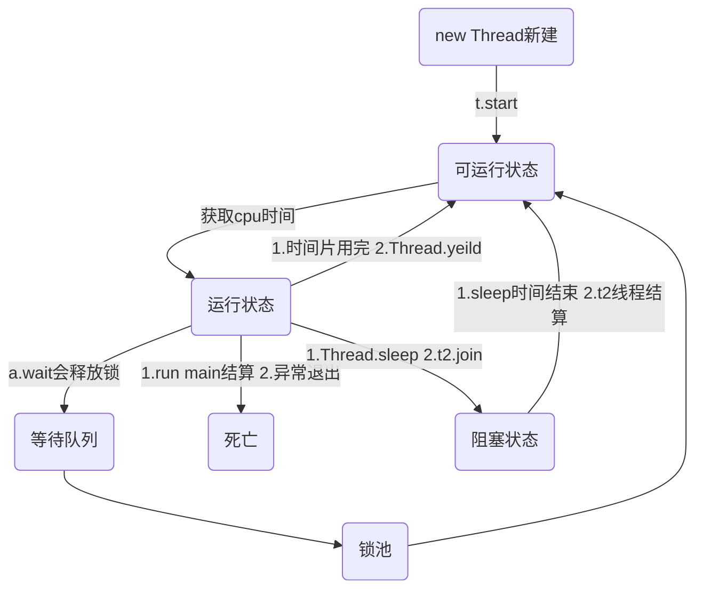

[TOC]


### 0 概念
#### 1.进程和线程
进程程序资源分配的最小单位，进程内部有多个线程，会共享这个进程的资源线程，cpu调度的最小单位.
#### 2.并发和并行
并行：同一时刻 可以处理事情的能力
并发：单位时间内可以处理事情的能力

#### 3.线程如何启动和中断
##### 线程如何启动
1)继承Thread
2)实现Runnable
3)实现callable
##### 线程如何中断
以前方法 #stop #resume #susupend 已经废弃直接中断，不会释放资源
现在
interrupt:中断线程 并不是强行关闭这个线程，只是打个招呼 中断的标志位置为true
isInterrupted:判断当前线程是否处于中断状态
Thread.interrupted:断定当前线程是否处于中断位置，中断标志改成false

#### 1.什么叫线程同步
是指线程与线程之间的制约关系，一个线程的执行依赖于另一个线程的消息，当它没有达到另一个线程的消息应等待，直到消息到达时被唤醒
#### 2.独占模式和共享模式
处于独占模式其他线程获取该锁将无法获取成功
在共享模式，多个线程获取某个锁可能获取成功
#### 3.活跃性问题
##### 1).死锁
##### 2).饥饿
一个线程或者多个线程因为种种原因无法获取所需资源，导致一直无法执行的状态
造成原因：
a.高优先级的线程吞噬低优先级的线程的cpu时间片
#setPriority 1-10 默认是5
b.线程永久阻塞在等待进入同步块的状态
c.等待的线程永远不会被唤醒
##### 3).活锁
#### 4.性能
多线程不一定提高性能
#### 5.线程安全性问题
多个线程共享资源
对资源进行非原子性操作

##### 1.单例模式
（1）饿汉式
```
/**
 * 饿汉式
 * 绝对的线程安全
 */
public class Test1 {

    private static Test1 t = new Test1();

    private Test1() {
    }

    public static Test1 getInstance() {
        return t;
    }
}

```
（2）懒汉式
```

/**
 * 懒汉式
 */
public class Test2 {

    /**
     * 禁止指令重排序
     */
    private volatile Test2 t;

    private Test2() {

    }

    /**
     * 双重检查加锁
     * 
     * @return
     */
    public static Test2 getInstance() {
        if (t == null) {
            synchronized (Test2.class) {
                if (t == null) {
                    t = new Test2();
                }
                //一般步骤是 1. 申请内存空间
                //2 实例化对象
                //3 instance引用指向这块空间地址
                // JVM存在指令重排 比如 1 3 2
            }
        }
        return t;
    }
}

```

#### 6.线程通信


### 1.Thread

#### 1.setDaemon
```
    public final void setDaemon(boolean on) {
        checkAccess();
        //setDaemon(boolean on) 方法，必须在Thread#start() 方法之前调用，否则运行时会抛出异常
        if (isAlive()) {
            throw new IllegalThreadStateException();
        }
        daemon = on;
    }
```
java中线程分 user Thread 和daemon thread,
异:当所有非守护线程结束了,程序就结束了,同时会杀死所有守护线程
设置该线程为守护线程

### 2.Lock接口
lock可以显示地获取锁和释放锁，繁琐，能让代码更灵活
synchronized不需要显示的获取和释放锁，简单
##### a.非阻塞的获取锁
##### b.能被中断的获取锁
##### c.超时获取锁
### 3.AbstractQueuedSynchronizer AQS
###### 独占模式
其他线程试图获取该锁将无法取得成功
###### 共享模式
多个线程获取某个锁可能（但不是一定）会获得成功

##### 1）tryAcquire(int)
##### 2）tryRelease(int)
##### 3） tryAcquireShared(int)
##### 4） tryReleaseShared(int)
##### 5）isHeldExclusively()

## 4.线程池


