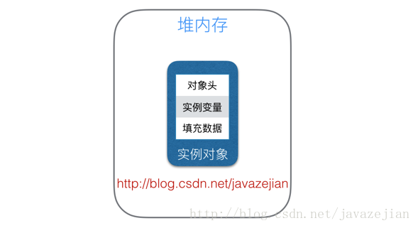

## java多线程笔记
[TOC]

### 一 并发关键字
#### 1.volatile
1).保证线程之间可见性;

2).禁止指令重排序，会在指令序列中插入内存屏障
使用场景:一个线程写 多个线程读

原理: 底层多了一个lock指令（将当前处理器缓存行写到系统内存 写回到内存中操作会使其他cpu里缓存该内存地址的数据失效(一致性协议,每个处理器嗅探在总线传播的数据来检测自己缓存是否过期)）

磁盘-》内存 -》cpu内存

 缺点:性能低 ，而且非原子性保证不了

简单理解:该会告诉JVM当前修饰的变量是不不确定中，需要从主内存中读取

```java

public class VolatileT {
	public static void main(String[] args) {

		VolThread vo = new VolThread();
		new Thread(vo).start();

		while (true) {
			if (vo.isA()) {
				System.out.println("结束");
				break;
			}
		}
	}
}

@Data
class VolThread implements Runnable {
	private volatile boolean a = false;

	@Override
	public void run() {
		try {
			Thread.sleep(200);
		} catch (InterruptedException e) {
			e.printStackTrace();
		}
		a=true;
		System.out.println("a=" + a);
	}
}
```
上述的代码不加volatile 会while true死循环，如何加上volatile所以可以证明，main线程中的a读取不是才能够线程的私有内存中读取而是从主内存中读取

局限性：
（1）不具备原子性
（2）不具备互斥性
#### 2.synchronized关键字

java 虚拟机对synchronized优化：（无锁状态，偏向锁，轻量级锁，重量级锁）

jvm底层，监视器和锁在java虚拟机中是一块使用，监视器监视一块同步代码块，确保，确保一次只有一个线程执行同步代码块。每一个监视器都和一个对象引用相关联。线程在获取锁之前不允许执行同步代码。
##### （1）java对象头 

在jvm中，对象在内存中的布局分成三块区域:对象头 实例数据



- 实例变量：存放类的属性数据信息，包括父类的属性信息，如果是数组的实例部分还包括数组的长度，这部分内存按4字节对齐。

- 填充数据：由于虚拟机要求对象起始地址必须是8字节的整数倍。填充数据不是必须存在的，仅仅是为了字节对齐，这点了解即可。

  jvm中采用2个字来存储对象头(如果对象是数组则会分配3个字，多出来的1个字记录的是数组长度)，其主要结构是由Mark Word 和 Class Metadata Address 

  | **虚拟机位数** | **头对象结构**         | **说明**                                                     |
  | -------------- | ---------------------- | ------------------------------------------------------------ |
  | 32/64bit       | Mark Word              | 存储对象的hashCode、锁信息或分代年龄或GC标志等信息           |
  | 32/64bit       | Class Metadata Address | 类型指针指向对象的类元数据，JVM通过这个指针确定该对象是哪个类的实例。 |

  

  | 锁状态   | 25bit        | 4bit         | 1bit是否是偏向锁 | 2bit 锁标志位 |
  | -------- | ------------ | ------------ | ---------------: | ------------- |
  | 无锁状态 | 对象HashCode | 对象分代年龄 |                0 | 01            |


#### 3.原子类

（1）
内置锁 互斥锁
可以修饰普通方法
静态方法
代码块
获取和释放锁均由 JVM控制

### 二 java锁
对象锁的信息存在哪？
对象头的信息
mark word
class metadata address
array length
存在对象头的信息:
a.线程id
b.epoch
c.对象的分代年龄信息
d.是否是偏向锁
e.锁的标志位

#### 1.自旋锁
自旋锁原理非常简单，如果持有锁的线程能在很短时间内释放锁资源，那么那些等待竞争锁的线程就不需要做内核态和用户态之间的切换进入阻塞挂起状态，它们只需要等一等（自旋），等持有锁的线程释放锁后即可立即获取锁，这样就避免用户线程和内核的切换的消耗。
使用CAS算法原子操作，lock将flag设置为currentThread，并预测原来为null，unlock将flag设置为null，实现锁及解锁
```java
	private AtomicReference<Thread> flag = new AtomicReference<>();


	public void lock() {
		Thread current = Thread.currentThread();
		//如果预期值是null 则set current 返回true
		while (!flag.compareAndSet(null, current)) {
			Thread.yield();
		}
	}

	public void unlock() {
		Thread current = Thread.currentThread();
		//设置为空
		flag.compareAndSet(current, null);
	}
```
#### 2.偏向锁
顾名思义 它会偏向于第一个访问锁的线程
每次获取锁和释放锁会浪费资源
很多情况下，竞争锁不是由多个线程，而是由一个线程在使用
#### 3.轻量级锁
偏向锁运行在一个线程进入同步块的情况下，当第二个线程加入锁争用的时候，偏向锁就会升级为轻量级锁
每个线程都可同时进入，自旋获取锁失败，升级为重量级锁

#### 4.重量级锁
内置锁在Java中被抽象为监视器锁（monitor）。在JDK 1.6之前，监视器锁可以认为直接对应底层操作系统中的互斥量（mutex）。这种同步方式的成本非常高，包括系统调用引起的内核态与用户态切换、线程阻塞造成的线程切换等。因此，后来称这种锁为“重量级锁”。
__重量级锁是悲观锁的一种，自旋锁、轻量级锁与偏向锁属于乐观锁__

#### 5.悲观锁
总是假设最坏的请情况，每次去拿数据的时候都会认为别人会修改 所以每次拿数据的时候都会上锁，这样别人拿这个数据都会阻塞直到它拿到锁
常见的关系型数据库都使用 行锁 表锁 读锁 和写锁 都是在操作之前先上锁
还要java中同步锁 synchronized

#### 6.乐观锁
每次去拿数据的时候都认为别人不会修改 所以不会上锁，但是更新的时候会判断一下 此期间别人有没有去更新这个数据，乐观锁适用于多读的应用类型，这样可以提高吞吐量
#### 7.重入锁
可重复可递归调用的锁，在外层适用锁之后，在内层仍然可以使用
#### 8.死锁 活锁
#### 9.公平锁
锁的获取顺序就应该符合请求的绝对时间顺序
#### 10.非公平锁
反之
#### 11.锁消除
虚拟机即时编译器在运行时，对一些代码要求同步，但是被检测到不可能存在共享数据竞争的锁进行消除，
#### 12.锁粗化
原则上，同步代码块作用的尽量小，但是经常加锁和解锁会导致不必要的性能损耗，锁粗化就是增大锁的作用域


### 三 并发算法

#### 1. CAS算法
无锁算法
CAS（Compare-And-Swap）算法保证数据操作的原子性。
CAS 算法是硬件对于并发操作共享数据的支持。
CAS 包含了三个操作数：
　　内存值 V
　　预估值 A
　　更新值 B
当且仅当 V == A 时，V 将被赋值为 B，否则循环着不断进行判断 V 与 A 是否相等。

有ABA问题，如果第二个修改从A又修改成A，则也满足
```java
	private int value;

	public synchronized int getValue() {
		return value;
	}

	public synchronized int compareAndSwap(int expectVal, int newVal) {
		int oldValue = value;
		if (oldValue == expectVal) {
			this.value = newVal;
		}
		return oldValue;
	}

	public synchronized boolean compareAndSet(int expectVal, int newVal) {
		return expectVal == compareAndSwap(expectVal, newVal);
	}
```