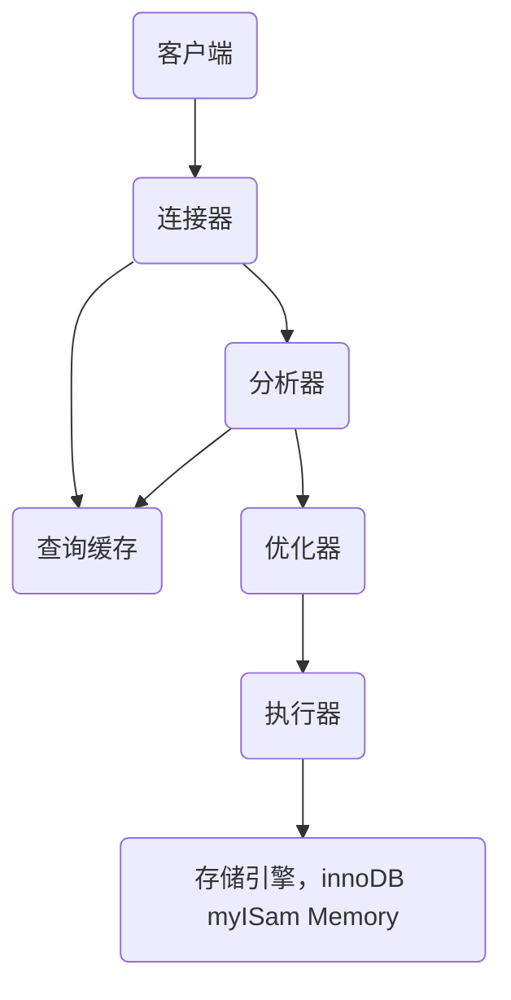

### 0.mysql 基本架构


客户端通过连接连接器建立连接，获取权限 维持和管理，本地配置mysql环境变量可以通过如下建立连接

```
mysql -h127.0.0.1 -P3306 -uroot -p
```

缓存器中sql语句作为key，查询结果作为value以键值对的形式存在，如果缓存命中直接返回查询结果，(不推介使用mysql的查询缓存，如果对该表进行修改，查询缓存就会失效，可以中query_cache_type控制，也可以通过select sql_cache * from tab1进行缓存，mysql8.0以后查询缓存功能已经删了)

分析器的作用语法解析，error in your sql  syntax 错误一般就是该模块报错

然后就是优化器，比如索引的选择，join表的连接顺序等

执行器

select * form tab  where id = 1；id不是索引

1. 调用InnoDB引擎接口取这个表的第一行，判断ID值是不是1，如果不是则跳过，如果是则将这行存在结果中；

2. 调用引擎接口取“下一行”，重复相同的判断逻辑，直到取到这个表的最后一行。

3. 执行器将上述遍历过程中所有满足条件的行组成的记录集作为结果集返回给客户端。

#### 1)mysql日志系统

   ##### redo log
innoDB引擎的日志文件，它的大小的固定的，当文件满时，从头开始记，内部有write pos记录当前位置，checkpoint记录当前擦除位置
1. 记录START T
2. 记录事务需要修改记录的新值（要求持久化）
3. 记录COMMIT T（要求持久化）
4. 将事务相关的修改写入数据库 
##### binlog
binlog是mysql的Server层，记录的是语句的最原始逻辑，可以借助该恢复mysql的数据
平时我们会对数据进行备份操作，然后取到最近备份的数据，找到从备份的时间点开始，将binlog从备份数据的时间起依次取出，重放到数据丢失前，就可以恢复数据


### 1.mysql的索引

查找数据时，当数据量过大时，查询速度会很慢，索引就好像书签一样，为了方便找到自己想要的内容，所有在设计表的时候合理的建立索引会提高查询效率

索引模型，也是简单的数据结构，哈希表 有序数组和搜索树,

#### 1).哈希表


索引分类

- 主键索引： 不允许重复，值不允许为null，一个表只能有一个主键

- 唯一索引：不可为空， 可为null,具有唯一性（还有联合多个字段-最左匹配原则）

- 普通索引：不唯一，可为null

- 全文索引：

#### a.索引优劣

查询快，降低数据IO成本，降低数据排序成本，降低cpu消耗；

劣:需要额外占用存储空间，索引实际上也是一张表记录主键和索引字段；降低更新的表的速度，表的数据发生了变化，索引可能要一起变更，新建数据，也要建立相应的索引，会增加相应时间，所以要合理的建立索引最佳.

mysqlslap 压力测试


### 2.mysql存储引擎
#### 1)myisam
不支持事务
空间类应用(gis)

#### 2)inno

支持事务ACID


#### 区别

|   点   |                    MyIsam                    |       InnoDB       |
| :----: | :------------------------------------------: | :----------------: |
| 主外键 |                    不支持                    |        支持        |
|  事务  |                    不支持                    |        支持        |
|   锁   | 表锁，操作一条数据锁住整个表（高并发不推荐） |     行锁，表锁     |
|  缓存  |                  只缓存索引                  | 索引及数据均可缓存 |
| 表空间 |                      小                      |         大         |
| 关注点 |                     性能                     |        事务        |

#### 3) csv
用excel打开,无法创建索引，可以对数据进行编辑

### mysql架构
mysql缓存
优化器

### 3.mysql事务

```
-- 1.查看当前表的存储引擎
show create table te ;
show variables like '%storage_engine%';
-- 2.开启事务、事务回滚、事务提交、还原点
begin/rollback/commit/savepoint
show variables like '%autocommit%'
-- 关闭自动提交
set autocommit = 0;
insert into te values(3,3);
savepoint n1;
insert into te values(4,4);
savepoint n2;
insert into te values(5,5);
rollback to savepoint n1;

select * from te

关闭事务自动提交，插入3,set n1,插入4,set n2,插入5 查询三条已插入，执行rollback n1，查询有一条数据插入
```


#### 1) 特性ACID
```
1.原子性：一个事务是不可分割的工作单位，一批操作要么成功要么失败
例,a转b100元，a账号减100，b账号就增加100;
2.一致性：从一个一致性状态变到另一个一致性状态，
例,a转b100元，a账号减100，b账号就增加100,增加和扣减的符合，这就是一直性	
3.隔离性：一个事务执行不能被其它事务干扰，
4.持久性：一个事务一旦提交，它对数据库中的数据改变就应该是永久性
例,事务提交了，数据就会被持久到磁盘中
```
##### 隔离性

1.未提交读(脏读) read uncommitted

事务a读取了事务b更新的数据，然后b回滚，那么a读取到就是脏数据

```
原数据
id	score
1	100
事务a
-- 1. 设置未提交读
set session transaction isolation level read uncommitted;
-- 2.开启事务
begin
update te set score = score -1 where id = 1;
select * from te where id = 1;
-- 3.事务回滚
ROLLBACK

事务b
-- 1. 设置未提交读
set session transaction isolation level read uncommitted;
-- 2.开启事务
begin
-- 3.查询
select * from te where id = 1;

先执行a1 a2 然后执行b1 b2 执行a-update操作，然后执行b3，结果为99，然后a3回滚事务，b3读取的就是脏数据
```


2.已提提交读(不可重复读)-read commited

事务a多次读取同一条数据，事务b修改了数据并提交，导致事务a读取到的数据前后不一致

```
事务a
-- 1. 设置已提提交读(不可重复读)
set session transaction isolation level read committed;
-- 2.开启事务
begin
update te set score = score -1 where id = 1;
-- 3.查询
select * from te where id = 1;
-- 4.事务回滚
ROLLBACK

事务b
-- 1. 设置已提提交读(不可重复读)
set session transaction isolation level read committed;
-- 2.开启事务
begin
-- 3.查询
select * from te where id = 1;
commit

先执行a1 a2 然后执行b1 b2 执行a-update操作，执行a3为结果查询为99，而b3查询结果还是100
但是事务a提交了，b3查询则为99，这就是跟可重复读区别
```


3.可重复读-repeatable read

事务a开启，事务b开启，事务a修改后，提交事务，事务b查询时修改前的数据

```
事务a 
-- 1.设置已提提交读(不可重复读)
set session transaction isolation level repeatable read;
-- 2.开启事务
begin
update te set score = score -1 where id = 1;
-- 3.查询
select * from te where id = 1;
-- 4.事务回滚
ROLLBACK
commit

事务b
-- 1. 设置已提提交读(不可重复读)
set session transaction isolation level repeatable read;
-- 2.开启事务
begin;
-- 3.查询
select * from te where id = 1;
commit

先执行a1 a2 然后执行b1 b2,然后执行a-update，查询a3结果为99，查询b3结果为100，然后事务commit，继续查询b3结果还是100，然后b3commit，重新执行b3，结果则变成99
```


4.可串行读-serializable

```
幻读:事务a开启，将表中所有数据修改成1，同时事务b插入一条值为2的数据，a就会发现自己并未完全修改好，sql就不来演示了
```

__总结__

- 1.事务隔离级别为可重复读，如果有索引的时候，已索引为条件更新数据，会存在行锁、页锁、间隙锁的问题，如果没有索引，更新数据时会锁住整张表(行锁升级为表锁);
- 2.隔离级别越高，越能保证事务的一致性，并发性能就较低，根据自己应用，合理选择事务的隔离级别;
- 3.不可重复读侧重于修改，幻读侧重于新增和删除，解决不可重复读锁行，而幻读则要锁表;
- 4.事务级别为串行化时，读写数据则会锁住整张表;


### 4.逻辑设计

第一范式:所有字段都有单一的属性

第二范式:每个都具有业务主键

第三范式：非主键对主键的传递依赖

订单1 订单序号1 客户编号 客户名称

反范式化设计

### 5.慢查询

如何统计一些耗时的sql语句，下面就来试试mysql的慢查询功能

```
show VARIABLES like '%dataDir%'
-- 1.慢查询 \Data\MACHENI-DC8HP36-slow.log
show variables like '%slow_query_log%'
set global slow_query_log = 1;
-- 2.设置慢查询耗时 默认 10
show variables like '%long_query_time%' 
set global long_query_time = 0
-- 3.日志文件 file 如果设置为table则会在 mysql库.slow_log表里记录
show variables like '%log_output%'

首先要开启慢查询，查看慢查询日志地址(2)，这里为了验证日志，直接将long_query_time为0
随便执行查询sql，发现slow.log多了数据
```

slow.log日志信息

```
# Time: 2019-10-19T14:13:06.593206Z
# User@Host: root[root] @ localhost [::1]  Id:   144
# Query_time: 0.000209  Lock_time: 0.000179 Rows_sent: 0  Rows_examined: 0
SET timestamp=1571494386;
SELECT * FROM `mysky`.`te` LIMIT 0;
第一行:执行时间;
第二行:用户、ip、线程id;
第三行:query_time查询花费时间，获得锁的时间，获得结果行数，扫描数据行数;
第四行:具体执行时间;
第五行:执行sql语句;
信息可参考mysql库.slow_log表
```

#### 1） 慢查询分析工具 mysqldumpslow

```
.\mysqldumpslow.pl -s t -t 10 D:\javaSoft\mysql-8.0.16-winx64\mysql-8.0.16-winx64\Data\MACHENI-DC8HP36-slow.log
```

#### 2)pt-query-digest

<https://blog.csdn.net/it_tifarmer/article/details/92224646>

### 6.存储过程

```

-- delimiter默认值为分号； 告诉解析器该段命令已经结束
delimiter @@
select * from te @@
delimiter ;
-- 1.创建存储过程 
create procedure method1()
begin
select 'table1';
select 'table2';
end;

call method1

-- 2.1 定义局部变量
-- declare 变量名 数据类型 default 默认值
create procedure test1()
begin
declare var varchar(10) default 'hello';
select var;
end;

call test1


create procedure test2()
begin
declare var varchar(10) default 'hello';
set var = 'word';
select var;
end;
call test2

call test1
-- 2.2 参数 in var in 该参数的值在调用后，值不会被改变
create procedure test3(in var varchar(20))
begin
select var;
end;

set @var='hello-word'
call test3(@var)

-- 2.3 out输出参数 会被改变
create procedure test4(out var1 varchar(20))
begin
select var1;
set var1='test4';
select var1;
end;

set @var1='hello-word'
call test4(@var1)
select @var1
-- 2.5 inout 输入输出参数
create procedure test5(inout a int)
begin
select a;
set a=100;
select a;
end;

set @a=10;
call test5(@a);
select @a;
```


## 题

### (1)mysql 什么情况下行锁会升级为表锁
如果我们where条件对索引列进行上锁，不会出现;如果我们where条件对非索引列进行上锁，则会出现表锁变成行锁
```
BEGIN
select * from course where name = '张三1' for update
-- 上述只针对name='张三1'进行行锁，但是会发现执行下面sql会出现等待，说明已经升级为表锁
update course set name = 'summit' where id = 5
```
### (2)生产上，有一张表数据量很大，这时候升级系统,如果A需要增加个字段，并发量白天都很大，请问怎么操作

因为数据量很大，修改表结构的时候会出现表锁，消耗时间很长，会导致这段时间卡顿；

首先创建一个和你要执行的alter操作的表一样的空间结构，然后copy原表的数据到新表；

在原表创建一个触发器在数据copy过程中，将原来更新的数据的操作全部更新到新的表中来；

copy完成后，用rename table表名，默认删除原表；

