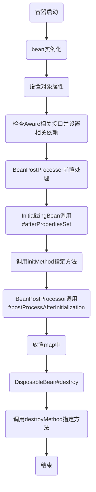

[TOC]

### 1.bean的生命周期

__创建->初始化->销毁__




#### 1.@Bean initMethod和destroyMethod

指定该bean的初始化和销毁方法

#### 2.实现接口InitializingBean，DisposableBean

#### 3.JSR250

使用注解 @PostConstruct初始化操作 @PreDestroy销毁操作
#### 4.BeanPostProcessor


### 1.代码
#### 1.1 bean对象
```

public class MyInitBean implements InitializingBean, DisposableBean , BeanPostProcessor {
    @Override
    public Object postProcessBeforeInitialization(Object bean, String beanName) throws BeansException {
        System.out.println("-------Before-BeanPostProcessor---"+bean+"     "+beanName);
        return bean;
    }

    @Override
    public Object postProcessAfterInitialization(Object bean, String beanName) throws BeansException {
        System.out.println("-------After-BeanPostProcessor---"+bean+"     "+beanName);

        return bean;
    }
    private void init() {
        System.out.println(" -----指定方法 InitEntity3 initMethod start*****************");
    }

    private void end() {
        System.out.println("-----指定方法 InitEntity3 initMethod destroyMethod*****************");
    }

    public MyInitBean() {
        System.out.println("-----构造器");
    }

    @Override
    public void destroy() throws Exception {
        System.out.println("-----接口DisposableBean destroy");
    }

    @Override
    public void afterPropertiesSet() throws Exception {
        System.out.println("-----接口InitializingBean afterPropertiesSet");
    }

    @PostConstruct
    public void PostConstruct() {
        System.out.println("------ 注解@PostConstruct--");
    }

    @PreDestroy
    public void PreDestroy() {
        System.out.println("------ 注解@PreDestroy--");
    }


}

```
#### 1.2 配置类
```
@Configuration
public class MyConfiguation {
    @Bean(initMethod = "init",destroyMethod = "end")
    public MyInitBean myInitBean() {
        return new MyInitBean();
    }
}

```
#### 1.3 测试类
```
    public static void main(String[] args) {
        AnnotationConfigApplicationContext applicationContext = new AnnotationConfigApplicationContext(MyConfiguation.class);
        System.out.println("_--------------------------------_");
        applicationContext.close();
        System.out.println("_--------------------------------_");
    }
```
#### 1.4 结果
```
-----构造器
------ 注解@PostConstruct--
-----接口InitializingBean afterPropertiesSet
 -----指定方法 InitEntity3 initMethod start*****************
-------Before-BeanPostProcessor---org.springframework.context.event.EventListenerMethodProcessor@276438c9     org.springframework.context.event.internalEventListenerProcessor
-------After-BeanPostProcessor---org.springframework.context.event.EventListenerMethodProcessor@276438c9     org.springframework.context.event.internalEventListenerProcessor
-------Before-BeanPostProcessor---org.springframework.context.event.DefaultEventListenerFactory@33b37288     org.springframework.context.event.internalEventListenerFactory
-------After-BeanPostProcessor---org.springframework.context.event.DefaultEventListenerFactory@33b37288     org.springframework.context.event.internalEventListenerFactory
_--------------------------------_
------ 注解@PreDestroy--
-----接口DisposableBean destroy
-----指定方法 InitEntity3 initMethod destroyMethod*****************
_--------------------------------_

```