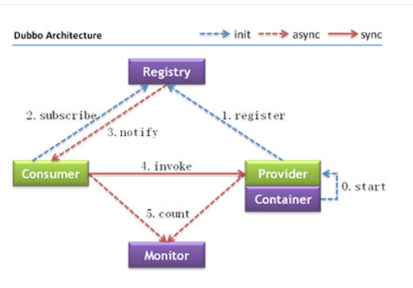

## 分布式框架

### 1.概念

集群：部署两个相同的server

分布式：如将一个server拆分成多个模块,比如（支付和订单），通过多个模块一起服务，完成一个完整的功能

副本机制：ab备份，多个节点提供服务，通过主从来实现服务的高可用方案

中间件：操作系统提供服务外，又不属于应用，它是位于应用和系统之间为开发者方便处理通信，输入输出的

### 2.分布式面临问题

1.三态，本来只存在成功或者失败，现在可能会**超时或者未知**

2.分布式事务  多个存储节点下数据库一致性问题

3.负载均衡 服务层负载，服务发现

4.一致性 cap

5.故障的独立性 

### 3.SOA架构和微服务架构

soa面向服务 有序 服用 

微服务 ：组件化，去中心化，基础设施自动化

区别：去中心化，没esb

2.领域驱动设计及业务驱动

一种概念，

### 4.CAP和BASE理论

分布式一致性问题,

银行转钱，一天后到，一致性弱

**cap：一致性 可用性 分区容错**

ap cp只能选择一种


**Base：**

基本可用：降级，

软状态：状态机(待支付，处理中 成功 失败)

数据最终一致性:基于MQ重试机制，发布订阅


# 一 zookeeper

## 1.zookeeper 安装

```
https://zookeeper.apache.org/releases.html zookeeper下载地址
tar -zxvf zookeeper-3.4.12.tar.gz
cd conf
cp zoo_sample.cfg zoo.cfg
bin/zkServer.sh start
启动ok

2.集群部署
ip:port1:port2
port1:各个节点之间连接端口,数据同步，port2：选举端口

vi conf/zoo.cfg
设置
dataDir=/usr/local/zookeeper/data
在dataDir目录下
vi myid
根据server.n
如果n=0,在myid插入0，wq保存退出

server.0=192.168.1.107:2888:3888
server.1=192.168.1.108:2888:3888
server.2=192.168.1.109:2888:3888

可以通过vi zookeeper.out查看zookeeper启动情况
server.0=192.168.1.107:2888:3888:observer 设置为观察者，不参与选举，提升写性能


```

从架构的发展说起

传统的单项目（单体架构），

服务拆分，用户服务->订单服务->商品服务

如果订单访问过多，可以部署多个订单服务，实现集群

困难：（中间件）

1.协议地址的维护

2.负载均衡机制

3.服务动态上下线感知

### 1.什么是zookeeper

```
开源的分布式协调服务，集群的管理者，监视着集群中各个节点的状态根据节点提交的反馈进行下一步合理的操作，将简单 易用的接口和性能高效 功能稳定的系统提供给用户。
功能：数据发布/订阅，负载均衡，命名服务，分布式协调/通知，集群管理，Master选举，分布式锁和分布式队列等功能
key/value存储

同级节点唯一性;临时节点和持久化节点;有序节点无序节点

命令 create get

create -e /tmp value 创建临时节点
```
### 1) 文件系统

多层级节点命名空间(znode)，这些节点可以设置关联的数据，而文件节点可以存放数据；zookeeper为了保证高吞吐和低延迟，存储的数据不能太大，上限为1M;

### 2）节点特性
持久化，临时节点，有序节点，同级节点必须唯一，临时节点不能存在子节点
### 3）节点的stat信息
### 4）watcher事件
### 5）应用场景
负载均衡  注册中心 配置中心 分布式锁


## 3.zookeeper设计猜想
zookeeper的由来，分布式架构下
1.各个节点的数据一致性
2.保证任务只在一个节点上执行
3.如果server挂了，其他节点如何发现并接替任务
4.存在共享资源，互斥
分布式协调问题
### 1）ZAB实现选举
支持崩溃恢复原子广播协议，只要勇于实现数据一致性

```
消息广播,崩溃恢复
当整个zookeeper集群刚刚启动或者lead服务宕机，重启，网络故障导致不存在过半的服务器与lead保持正常通信时，所有进行进入崩溃恢复模式，选举产生leader服务器，然后集群中follower与新的leader服务器进行数据同步，当集群超过半数机器与还leader服务完成同步之后，退出崩溃恢复模式进入消息广播模式，leader服务开始接收客户端事务请求组生成事务提案进行事务请求处理。
```


改进版的2pc
a.对每一个消息生成一个zxid(64位自增)
b.带有zxid的消息作为一个propose分发给集群中每一个follower节点
c.把propose这个事务写到磁盘中，返回一个ack
d.leader收到合法的数据请求ack以后，在发起commit请求

崩溃恢复
1.当leader失去了过半的follower节点联系
2.当leader服务怪了


### 2）zookeeper集群
如果是读请求，可以在任意节点去处理；如果是写请求，那么这个请求会转发给leader处理

服务器角色：

leader:事务请求的唯一调度者和处理者);

follower:处理非事务请求，参与事务propisal投票，参与leader选举);

observer:不参与任何形式的投票，处理非事务请求，转发事务请求给leader

zookeeper-server工作四种状态：looking，following，leading，observing

## 4.实践原理

### 1) 数据存储

### 2）事件机制

watcher监听机制，可以对这些节点绑定监听事件，比如监听节点数据变更，节点删除，节点状态变更（分布式锁和集群管理）

watcher特性：当数据发生变化的时候，zookeeper会产生一个watcher事件，并且会发送至客户端,但是客户端只会收到一次通知，后续如果这个节点再次发生变化，不会通知（一次性的）；可以通过循环监听达到永久监听效果

##### 如何注册事件机制

getData exists getChildren

触发事件机制

create delete setData

### 3）chroot特性

3.2.0之后，添加了chroot特性，该特性允许每个客户端为自己设置一个命名空间。如果一个客户端设置了Chroot，那么该客户端对服务器的任何操作，都将会被限制在其自己的命名空间下。

通过设置Chroot，能够将一个客户端应用于Zookeeper服务端的一颗子树相对应，在那些多个应用公用一个Zookeeper进群的场景下，对实现不同应用间的相互隔离非常有帮助

### 4) zookeeper分布式锁架构

基本步骤：

a.每个服务器多次从客户端create(在/root 临时有序节点);

b.getChilder("/root")获取所有子节点;

c.如果获取到的子节点是所有节点中序号最小的，那么认为这个客户端获取了锁;

d.否则，监听比自己节点小的节点中最大的节点，等待该子节点watch机制，然后在进行cd判断逻辑;

##### a.对比redis分布式锁

redis分布式锁实现步骤:

a.根据key值去setnx(if key存在，不操作返回0，反之，setkey值成功，返回1)，返回1获得锁成功，end；

b.如果没有获取到锁，getkey对应的value(存储的是时间戳),为了避免死锁，网往会给超时时间，如果返回是0，接着比较时间戳是否超过当前设置超时时间，如果没超过获取锁失败,如果超过获取锁成功，并重新set当前value(时间戳);

c.然后会存在setnx失败，get为空，则说明在这之间已经释放锁，然后反复去执行一次（senx get）;

##### b.优缺点

并发不是很常见的话，使用redis比较好，一次就成功，但是并发多的话，redis会一直去尝试获取锁，性能损耗大;而zookeeper有watch机制，只需添加一个监听器；还有就是连接redis的客户端如果程序出问题，导致没有及时释放锁，那么只能等待超时时间，而zookeeper客户端挂了，临时znode就没了，相当于释放了锁；

个人觉得zookeeper分布式锁比较好，但是我实际项目中没用过，基本使用redisson,非常简单好用,api封装很强大,都能满足项目场景。

# 二 dubbo

#### 1.架构



Provider和registry建立zk Session(临时节点)，暴露服务的服务提供方;

### 2.特性

##### 1）多协议支持

RMI hession webService http thirft Dubbo（默认）

官网<https://dubbo.apache.org/zh-cn/docs/user/demos/multi-protocols.html>

```xml
1.接口指定协议
<!-- 多协议配置 -->
    <dubbo:protocol name="dubbo" port="20880" />
    <dubbo:protocol name="rmi" port="1099" />
<!-- 使用dubbo协议暴露服务 -->
    <dubbo:service interface="com.alibaba.hello.api.HelloService" version="1.0.0" ref="helloService" protocol="dubbo" />
    <!-- 使用rmi协议暴露服务 -->
    <dubbo:service interface="com.alibaba.hello.api.DemoService" version="1.0.0" ref="demoService" protocol="rmi" /> 
</beans>
2.多协议暴露接口
 <!-- 多协议配置 -->
    <dubbo:protocol name="dubbo" port="20880" />
    <dubbo:protocol name="hessian" port="8080" />
    <!-- 使用多个协议暴露服务 -->
    <dubbo:service id="helloService" interface="com.alibaba.hello.api.HelloService" version="1.0.0" protocol="dubbo,hessian" />
```

##### 2）多注册中心
```xml
    <!-- 多注册中心配置 -->
    <dubbo:registry id="chinaRegistry" address="10.20.141.150:9090" />
    <dubbo:registry id="intlRegistry" address="10.20.154.177:9010" default="false" />
    <!-- 向中文站注册中心注册 -->
    <dubbo:service interface="com.alibaba.hello.api.HelloService" version="1.0.0" ref="helloService" registry="chinaRegistry" />
    <!-- 向国际站注册中心注册 -->
    <dubbo:service interface="com.alibaba.hello.api.DemoService" version="1.0.0" ref="demoService" registry="intlRegistry" />
```

启动检查

check=false client端不会去检查该服务是否开启

集群容错

负载均衡

##### 3）多版本支持

```
老版本服务提供者配置：
<dubbo:service interface="com.foo.BarService" version="1.0.0" />
新版本服务提供者配置：
<dubbo:service interface="com.foo.BarService" version="2.0.0" />
```

##### 4) 集群容错

failsafe 失败安全，错误吞并，记录日志

failover （默认2次 不包括第一次

failfast 失败立马报错

failback 失败后自动回复

forking 直接调用多个，有一个返回成功就算成功

broadcast 广播，全成功才成功有一台失败即失败

配置级别：

客户端由于服务端

方法级别 接口 然后是全局配置

##### 5）服务降级

