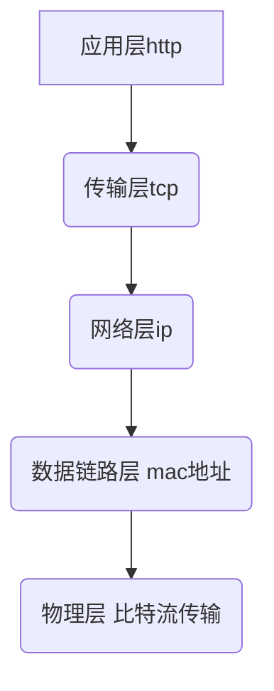

## 1.通信协议

是分布式协议的核心，

### 1.协议

TCP/IP：

**三次握手**，客户端和服务端发送三次来建立连接

为啥三次呢？

客户端要求建立连接申请（syn），服务端收到，并建立连接同时发送syn（回复），并说已建立好（ack）,

客户端收到ack，回复收到;

**四次挥手**：客户端和服务端发送四次来断开连接

为啥是四次，客户端首次要求关闭，服务端回复收到，但是服务端并不会立即关闭（原因，可能有些消息没消费完），所以只能等待服务端关闭的时候回复一次，客户端回复收到。

UDP/IP

muticast

分层，多层结构，网络通信 四层协议（其实是七层协议）

传输层：tcp头+http请求报文

网络层：ip+tcp头+http请求报文

数据链路层：mac地址+ip+tcp头+http请求报文

物理层：比特流

### 2.流

IO bio nio aio

### 3.Socket

### 4.NIO（netty、mina

### 5.序列化和反序列化

### 6.使用协议通信

socket基础，应用程序通过它来发送和接收消息

stream socket-tcp

datagram socket-udp

## 2.http和https

